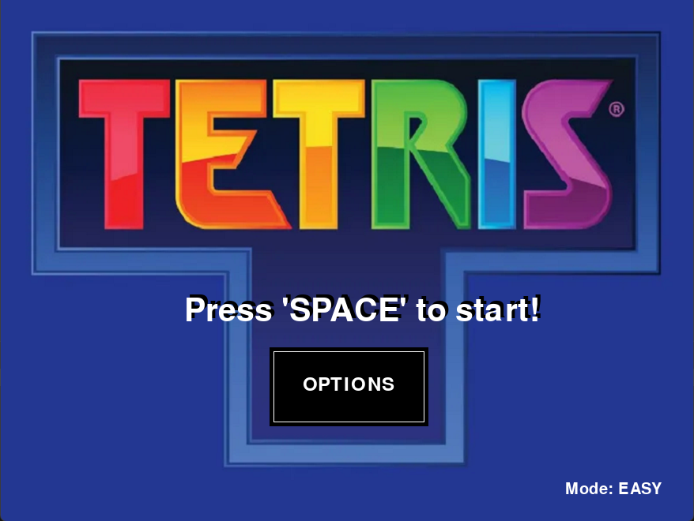
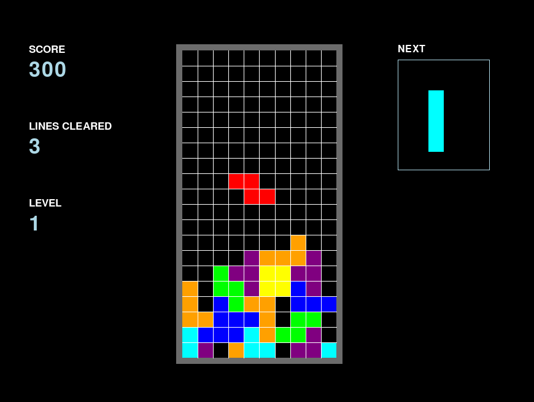

# Tetris (PyGame Zero Implementation)

## Overview
This project is a Python implementation of the classic Tetris game built using PyGame Zero. It emphasizes object-oriented design, real-time game loop architecture, and grid-based collision detection.

The system is structured around modular game states (start menu, gameplay, options, and game over) and includes core gameplay features such as tetromino rotation, collision handling, scoring, level progression, and adjustable difficulty.

<table>
  <tr>
    <td align="center"><br><sub>Home Screen</sub></td>
    <td align="center"><br><sub>Gameplay</sub></td>
  </tr>
</table>

---

## Controls

### Menu:
- **SPACE** → Start game
- **ESC** → Restart after game over
- **Mouse** → Navigate menus and select difficulty

### In-game:
- ⬅️ **Left Arrow** → Move tetromino left
- ➡️ **Right Arrow** → Move tetromino right
- ⬆️ **Up Arrow** → Rotate tetromino
- ⬇️ **Hold Down Arrow** → Speed up tetromino descent

---

## Installation

This project requires **Python 3** and **PyGame Zero**.

Install dependencies using:

```bash
pip install pgzero
